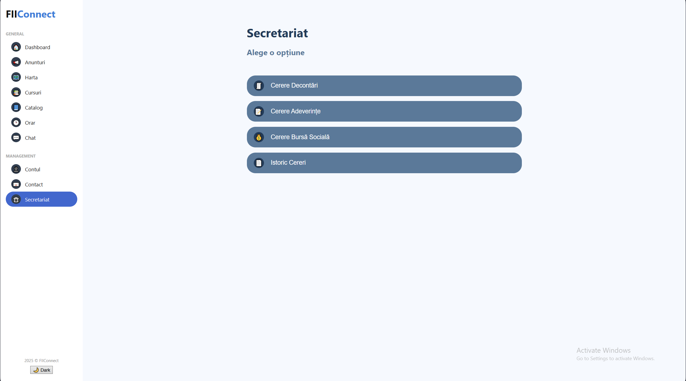
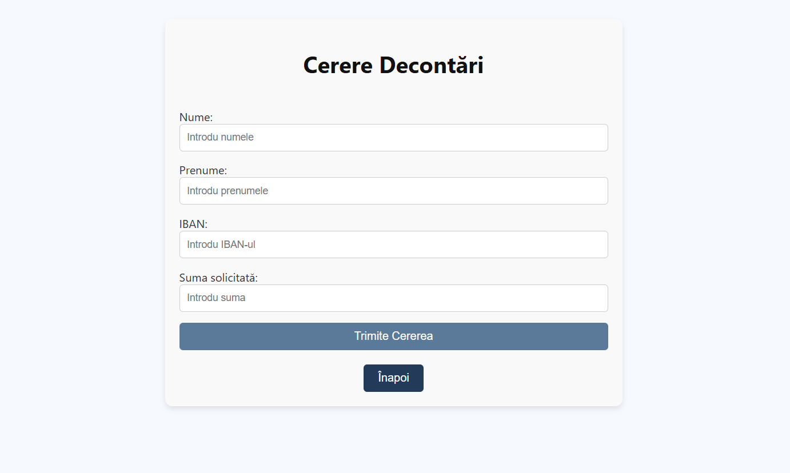
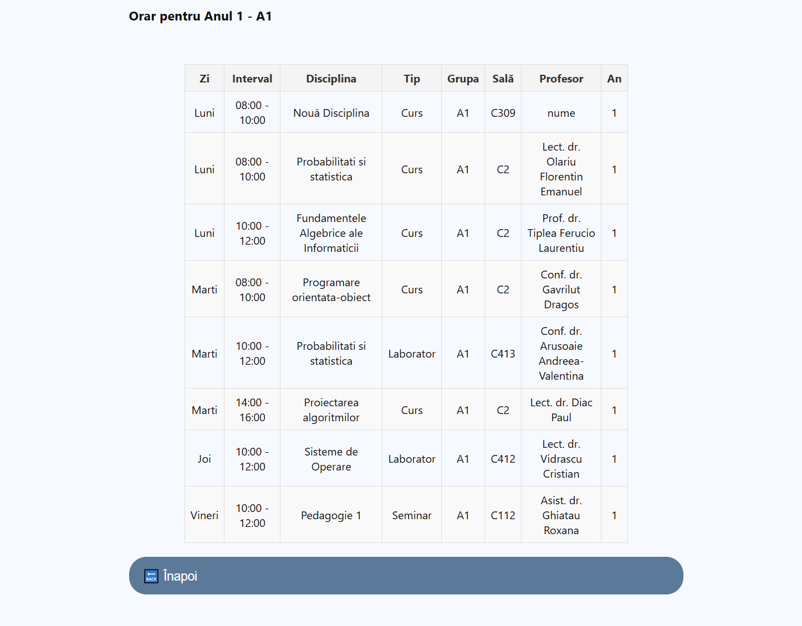

# 🎓 Faculty App – Resource & Secretariat Management(IN PROGRESS)

This is a university project focused on building a full-stack platform for academic resource scheduling, course management, and secretariat tasks.
The platform is split into a backend (Spring Boot) and a frontend (React), and it was developed in a collaborative team setting using Agile practices.

## ✨ Features

- Schedule viewing and modification
- Room booking with equipment details and images
- Resource management (rooms, equipment)
- Admin panel for Secretariat use
- Dynamic, real-time schedule updates

## 📁 Project Structure

### Backend (Spring Boot – Java)

- Follows the **Model-View-Controller (MVC)** pattern:
  - `Model` – Entities and data structure (e.g., `Orar.java`, `Sala.java`)
  - `Controller` – Exposes REST APIs (e.g., `OrarController.java`)
  - `Service` – Business logic layer 
  - `Repository` – Interfaces with the database via Spring Data JPA

### Frontend (React – JavaScript)

- Organized in reusable components:
  - `Orar.jsx` – Handles dynamic schedule rendering and editing
  - `OrarSecretariat.jsx` – Admin interface for managing resources and staff interactions
  - `Secretariat.jsx` 
-Frontend uses the native `fetch` API to send and receive data from the Spring Boot backend.

## 🖼️ UI Screenshots

### Secretariat Panel




### Schedule for students




## 🚀 How to Run

### Prerequisites

- Java 17+
- Node.js (v18+ recommended)
- Maven
- MYSQL or another SQL-compatible database

---

### 🛠️ Backend Setup

```bash
cd Backend2
cd api
mvn clean compile
mvn spring-boot:run
